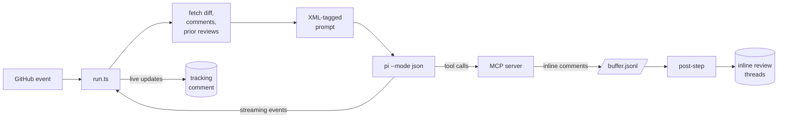

<p align="center">
  
</p>

> Model-agnostic AI code review for GitHub. Cross-check pull requests with independent review lenses and keep the model inside a review-only tool surface. Works with any provider [pi](https://github.com/earendil-works/pi) supports — DeepSeek, Z.AI, OpenAI, Anthropic, Google, Bedrock, Vertex, Groq, Mistral, xAI, OpenRouter.

[](https://github.com/selimozten/elek/actions/workflows/ci.yml)
[](LICENSE)

elek is a GitHub Action that posts AI reviews on every PR — top-level summaries in the tracking comment plus inline review threads on the lines that need attention. It can run one reviewer, a two-lens cross-check, or a four-lens council. Models can read code, search, and post review feedback. They cannot approve, merge, or close — that's a structural guarantee, not a runtime check.

```yaml
# .github/workflows/elek.yml
on: { pull_request: { types: [opened, synchronize] } }
permissions: { contents: read, pull-requests: write, issues: write }
jobs:
  review:
    runs-on: ubuntu-latest
    steps:
      - uses: actions/checkout@v6.0.3
        with: { fetch-depth: 0 }
      - uses: selimozten/elek@v1
        with:
          deepseek_api_key: ${{ secrets.DEEPSEEK_API_KEY }}
          provider: deepseek
          model: deepseek-v4-pro
```

## Why elek

| | elek | claude-code-action | gemini-cli |
|---|---|---|---|
| **Providers** | 11+ (any pi target) | Anthropic only | Google only |
| **Per-review cost** | ~$0.005 (deepseek) | ~$0.05 (sonnet) | ~$0.01 |
| **Inline review threads** | ✓ via MCP | ✓ via MCP | partial |
| **Iterates on prior findings** | ✓ | ✓ | partial |
| **Structural safety** | ✓ no merge/approve/close paths | ✗ has full PR API | ✗ has full PR API |
| **Modules** | ~20 files | 50+ | 30+ |
| **Runtime** | Node 20 + tsx | Bun + Claude CLI | Node + gcloud |

**Bias toward cheap, capable models.** DeepSeek-v4-Pro and GLM-5.1 are within striking distance of Sonnet 4.x on review tasks at ~10× lower cost. Run two of them in parallel for cross-validation; you'll still spend less than one Claude review.

## Quick start

1. Add a provider API key to repo secrets (`Settings → Secrets and variables → Actions`):

   ```
   DEEPSEEK_API_KEY  # or ZAI_API_KEY / OPENAI_API_KEY / ANTHROPIC_API_KEY / etc.
   ```

2. Drop this in `.github/workflows/elek.yml`:

   ```yaml
   name: elek
   on:
     pull_request: { types: [opened, synchronize, reopened] }
     issue_comment: { types: [created] }
     issues: { types: [opened] }

   permissions:
     contents: read           # blocks merge entirely (read-only)
     pull-requests: write     # post review comments
     issues: write            # post tracking comment

   concurrency:
     group: elek-${{ github.event.pull_request.number || github.event.issue.number || github.ref }}
     cancel-in-progress: true

   jobs:
     review:
       runs-on: ubuntu-latest
       timeout-minutes: 10
       steps:
         - uses: actions/checkout@v6.0.3
           with: { fetch-depth: 0 }
         - uses: selimozten/elek@v1
           with:
             deepseek_api_key: ${{ secrets.DEEPSEEK_API_KEY }}
             provider: deepseek
             model: deepseek-v4-pro
             thinking: high
   ```

3. Open a PR. Within ~3 minutes you'll see a tracking comment with a live progress checklist, then the final review (top-level summary + inline threads on changed lines).

To trigger from a comment, set `trigger_phrase` (default `@pi`) and write `@pi review the auth flow`.

## Modes

The `mode` input controls the model's tool surface:

| `mode` | Tools | MCP | Edits | Use case |
|---|---|---|---|---|
| `review` (default) | `read,grep,find,ls,mcp` | ✓ | ✗ | Code review only. Recommended. |
| `review+edit` | `+ write,edit` | ✓ | ✓ | Review + push fixes to an `elek/*` branch. |
| `agent` | `+ bash` | ✗ | ✓ | Legacy, full power. Trusted workflows only. |

**The model can never approve, merge, or close** in any mode — those endpoints aren't plumbed in elek's MCP server. The `permissions:` block in your workflow is the backstop.

## Review Strategies

The `review_strategy` input controls orchestration quality:

| `review_strategy` | Runs | Use case |
|---|---:|---|
| `solo` (default) | 1 final reviewer | Fast, cheap default review. |
| `crosscheck` | 2 read-only lenses + 1 final validator | Best default for serious PR review. |
| `council` | 4 read-only lenses + 1 final validator | Larger or high-risk PRs touching auth, billing, migrations, infra, or public APIs. |

`crosscheck` runs two independent candidate reviewers:

- **Risk Review** — correctness, security, breaking changes, devex regressions, feature-gate leaks.
- **Design Review** — maintainability, structural simplification, abstraction quality, file-size growth, spaghetti branching, type boundaries.

`council` adds:

- **Test Integrity Review** — missing/weak tests, nondeterminism, meaningless assertions.
- **Operational Review** — rollout/rollback safety, migrations, configuration, observability, retries, partial updates.

Candidate reviewers are read-only and cannot post. The final validator receives their reports, rejects speculative or duplicate findings, and posts only high-confidence feedback through elek's narrow review MCP tools.

```yaml
with:
  provider: deepseek
  model: deepseek-v4-pro
  review_strategy: crosscheck
  review_models: deepseek/deepseek-v4-pro,zai/glm-5.1
  validator_model: deepseek/deepseek-v4-pro
```

For expensive models, a good pattern is cheap parallel reviewers plus one stronger validator.

## Cross-Model Review

Run two providers in parallel for free cross-validation. Each model independently iterates on the other's findings:

```yaml
jobs:
  deepseek:
    runs-on: ubuntu-latest
    steps:
      - uses: actions/checkout@v6.0.3
      - uses: selimozten/elek@v1
        with:
          deepseek_api_key: ${{ secrets.DEEPSEEK_API_KEY }}
          provider: deepseek
          model: deepseek-v4-pro

  zai:
    runs-on: ubuntu-latest
    steps:
      - uses: actions/checkout@v6.0.3
      - uses: selimozten/elek@v1
        with:
          zai_api_key: ${{ secrets.ZAI_API_KEY }}
          provider: zai
          model: glm-5.1
```

On the second push, each model reads the other's prior findings (kept in the comment thread) and opens its review with a status table — fixed / still present / no longer relevant — before listing new findings. Same pattern claude-code-action uses.

## How it works



A composite Action installs Node + pi + the MCP adapter, then `tsx` runs the orchestrator. Pi spawns the model, streams events back as JSONL, and elek converts those into a live checklist. The model calls our MCP server to buffer inline comments; a post-step drains the buffer to GitHub's PR review-comments API after pi exits.

Full architecture: [docs/ARCHITECTURE.md](docs/ARCHITECTURE.md).

## Inputs

### Trigger / behavior

| Input | Default | Notes |
|---|---|---|
| `trigger_phrase` | `@pi` | Detected in comments, issue body, PR body |
| `prompt` | _(comment text)_ | Explicit prompt; bypasses trigger detection |
| `mode` | `review` | `review` / `review+edit` / `agent` |
| `review_strategy` | `solo` | `solo` / `crosscheck` / `council` |
| `review_models` | _(primary model)_ | Comma-separated reviewer model specs, e.g. `deepseek/deepseek-v4-pro,zai/glm-5.1` |
| `validator_model` | _(primary model)_ | Final synthesis model spec |
| `actor_filter` | _(empty)_ | Comma-separated allowlist of usernames |
| `allowed_bots` | _(empty)_ | Comma-separated bot logins, or `*` for all |
| `sticky_comment` | `true` | Reuse the same tracking comment across pushes |

### Model

| Input | Default | Examples |
|---|---|---|
| `provider` | `anthropic` | `deepseek`, `zai`, `openai`, `anthropic`, `google`, `groq`, `mistral`, `xai`, `openrouter` |
| `model` | _(provider default)_ | `deepseek-v4-pro`, `glm-5.1`, `claude-sonnet-4-5`, `gpt-4o`, `gemini-2.5-pro` |
| `thinking` | `medium` | `off` / `minimal` / `low` / `medium` / `high` / `xhigh` |
| `system_prompt` | _(pi default)_ | Override pi's system prompt |
| `max_turns` | `20` | Cap conversation turns |
| `tools` | _(mode-resolved)_ | Override the tool allowlist (rarely needed) |
| `base_branch` | _(repo default)_ | Override the comparison base |
| `branch_prefix` | `elek/` | Prefix for branches the action creates |

### API keys

Each provider has its own input; only set the one you use. Pi reads the matching `*_API_KEY` env var.

| Input | Env var |
|---|---|
| `anthropic_api_key` | `ANTHROPIC_API_KEY` |
| `openai_api_key` | `OPENAI_API_KEY` |
| `google_api_key` | `GOOGLE_API_KEY` |
| `deepseek_api_key` | `DEEPSEEK_API_KEY` |
| `zai_api_key` | `ZAI_API_KEY` |
| `groq_api_key` | `GROQ_API_KEY` |
| `mistral_api_key` | `MISTRAL_API_KEY` |
| `xai_api_key` | `XAI_API_KEY` |
| `openrouter_api_key` | `OPENROUTER_API_KEY` |

For AWS Bedrock: `AWS_REGION`, `AWS_ACCESS_KEY_ID`, `AWS_SECRET_ACCESS_KEY` as job-level env. For Vertex: `GOOGLE_APPLICATION_CREDENTIALS`, `ANTHROPIC_VERTEX_PROJECT_ID`.

## Outputs

| Output | Description |
|---|---|
| `conclusion` | `success` / `failure` / `skipped` |
| `branch_name` | The `elek/*` branch created (if any) |
| `comment_id` | The tracking comment ID |
| `session_id` | Pi session ID for resumption |
| `summary` | First 1000 chars of the review |

## Permissions

```yaml
permissions:
  contents: read           # blocks merge — model literally can't push to base
  pull-requests: write     # post review comments
  issues: write            # post tracking comment
```

For `mode: review+edit` (model pushes fixes to an `elek/*` branch), upgrade `contents: write`. The model still can't approve/merge — those scopes are separate, and the MCP server has no code path to `pulls.merge` regardless. `GITHUB_TOKEN` reviews don't satisfy required-approver counts on protected branches either.

## Supported events

- `pull_request` — opened, synchronize, reopened
- `issues` — opened
- `issue_comment` — created (on PRs or issues)
- `pull_request_review` — submitted
- `pull_request_review_comment` — created

## Cost expectations

Rough numbers for a typical mid-sized PR (~500 lines diff, 7-turn review):

| Model | Cost | Notes |
|---|---|---|
| deepseek-v4-pro (thinking: high) | ~$0.005 | Strong reviewer, very cheap |
| glm-5.1 (thinking: high) | ~$0.005 | Comparable to deepseek |
| gpt-4o-mini | ~$0.01 | Fast, decent for triage |
| claude-sonnet-4-5 (thinking: high) | ~$0.05 | Highest quality, ~10× the price |
| gpt-4o | ~$0.10 | High quality |

Running two cheap models in parallel for cross-validation costs less than one Claude review.

## Security

- The MCP server exposes exactly two tools: `create_inline_comment` and `update_tracking_comment`. There is no code path to `pulls.createReview({event: "APPROVE"})`, `pulls.merge`, or `issues.update({state: "closed"})`.
- `update_tracking_comment` is pinned to the env-passed `comment_id`; arg-level overrides are structurally inaccessible.
- Token sanitization redacts `ghp_`, `ghs_`, `gho_`, `ghu_`, `ghr_`, and `github_pat_` prefixes from any model output before it reaches GitHub.
- `.mcp.json` (which carries `GITHUB_TOKEN`) is written to `~/.config/mcp/`, never the workspace, and unlinked when pi exits.

Threat model: a fully jailbroken model still cannot perform destructive operations because the plumbing doesn't exist. The `permissions:` scope is the backstop.

## Documentation

- [`docs/ARCHITECTURE.md`](docs/ARCHITECTURE.md) — system overview
- [`docs/setup.md`](docs/setup.md) — step-by-step setup
- [`docs/examples.md`](docs/examples.md) — workflow recipes
- [`AGENTS.md`](AGENTS.md) — instructions for coding agents working on elek
- [`CONTRIBUTING.md`](CONTRIBUTING.md) — how to contribute

## Credits

Built on [pi coding agent](https://github.com/earendil-works/pi). MCP integration via [pi-mcp-adapter](https://github.com/nicobailon/pi-mcp-adapter). Patterns adapted from [claude-code-action](https://github.com/anthropics/claude-code-action), [gemini-cli](https://github.com/google-github-actions/run-gemini-cli).

## License

MIT
