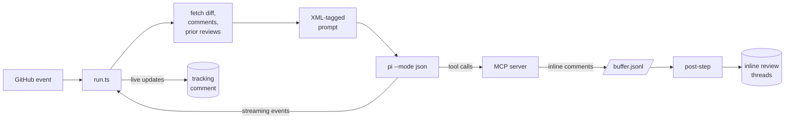

<p align="center">
  
</p>

<p align="center">
  <strong>Review-only AI for pull requests.</strong><br />
  Cross-check changes with independent models while keeping every reviewer inside a narrow, non-destructive tool surface.
</p>

<p align="center">
  <a href="https://github.com/selimozten/elek/actions/workflows/ci.yml"></a>
  <a href="LICENSE"></a>
</p>

elek is a model-agnostic GitHub Action that posts AI reviews on every PR. It works with any provider [pi](https://github.com/earendil-works/pi) supports: DeepSeek, OpenRouter, OpenAI, Anthropic, Google, Bedrock, Vertex, Groq, Mistral, xAI, and more.

It can run one reviewer, a two-lens cross-check, or a four-lens council. Models can read code, search, and post review feedback. They cannot approve, merge, or close — that's a structural guarantee, not a runtime check.

```yaml
# .github/workflows/elek.yml
on: { pull_request: { types: [opened, synchronize] } }
permissions: { contents: read, pull-requests: write, issues: write }
jobs:
  review:
    runs-on: ubuntu-latest
    steps:
      - uses: actions/checkout@v6.0.3
        with: { fetch-depth: 0 }
      - uses: selimozten/elek@v1
        with:
          deepseek_api_key: ${{ secrets.DEEPSEEK_API_KEY }}
          provider: deepseek
          model: deepseek-v4-pro
```

## Why elek

| | elek | single-provider review actions | general-purpose CLI actions |
|---|---|---|---|
| **Providers** | 11+ (any pi target) | usually one provider | usually one provider |
| **Per-review cost** | ~$0.005 (deepseek) | often premium-model priced | varies by hosted stack |
| **Inline review threads** | ✓ via MCP | often supported | partial |
| **Iterates on prior findings** | ✓ | often supported | partial |
| **Structural safety** | ✓ no merge/approve/close paths | often broader PR API access | often broader repo access |
| **Modules** | small TypeScript core | larger vendor stack | larger platform stack |
| **Runtime** | Node 24 + tsx | provider CLI/runtime | provider CLI/runtime |

**Bias toward cheap, capable models.** DeepSeek-v4-Pro plus Kimi K2.7 Code through OpenRouter gives you two independent review passes without defaulting to one expensive model. Run them in parallel for cross-validation; reserve premium validators for the highest-risk PRs.

## Quick start

Fast path from your repository root:

```bash
npx --package github:selimozten/elek elek-init --provider deepseek
```

This creates `.github/workflows/elek.yml` and `.elek.yml`.

1. Add a provider API key to repo secrets (`Settings → Secrets and variables → Actions`):

   ```
   DEEPSEEK_API_KEY  # or OPENROUTER_API_KEY / OPENAI_API_KEY / ANTHROPIC_API_KEY / etc.
   ```

2. Commit the generated files, or drop this in `.github/workflows/elek.yml` manually:

   ```yaml
   name: elek
   on:
     pull_request: { types: [opened, synchronize, reopened] }
     issue_comment: { types: [created] }
     issues: { types: [opened] }

   permissions:
     contents: read           # blocks merge entirely (read-only)
     pull-requests: write     # post review comments
     issues: write            # post tracking comment

   concurrency:
     group: elek-${{ github.event_name }}-${{ github.event.pull_request.number || github.event.issue.number || github.ref }}
     cancel-in-progress: true

   jobs:
     review:
       if: ${{ github.event_name != 'issue_comment' || !endsWith(github.actor, '[bot]') }}
       runs-on: ubuntu-latest
       timeout-minutes: 15
       steps:
         - uses: actions/checkout@v6.0.3
           with: { fetch-depth: 0 }
         - uses: selimozten/elek@v1
           with:
             deepseek_api_key: ${{ secrets.DEEPSEEK_API_KEY }}
             provider: deepseek
             model: deepseek-v4-pro
             thinking: high
   ```

3. Open a PR. Within ~3 minutes you'll see a tracking comment with a live progress checklist, then the final review (top-level summary + inline threads on changed lines).

Useful initializer variants:

```bash
npx --package github:selimozten/elek elek-init --provider openrouter --model moonshotai/kimi-k2.7-code
npx --package github:selimozten/elek elek-init --strategy crosscheck --max-cost-usd 0.05
npx --package github:selimozten/elek elek-init --no-config
```

The final comment includes an estimated token/cost line by default:

```text
Estimated review cost: $0.0012 (3,420 in / 810 out tokens)
```

For models without built-in price hints, elek still reports token estimates and
returns `$0.0000` until you provide `cost_rates`.

To trigger from a comment, set `trigger_phrase` (default `@pi`) and write `@pi review the auth flow`.

## Modes

The `mode` input controls the model's tool surface:

| `mode` | Tools | MCP | Edits | Use case |
|---|---|---|---|---|
| `review` (default) | `read,grep,find,ls,mcp` | ✓ | ✗ | Code review only. Recommended. |
| `review+edit` | `+ write,edit` | ✓ | ✓ | Review + push fixes to an `elek/*` branch. |
| `agent` | `+ bash` | ✗ | ✓ | Legacy, full power. Trusted workflows only. |

Use `mode` to choose the tool surface. The low-level `tools` input is kept
for compatibility and debugging; review modes still resolve to the safe mode
presets.

**The model can never approve, merge, or close** in any mode — those endpoints aren't plumbed in elek's MCP server. The `permissions:` block in your workflow is the backstop.

## Review Strategies

The `review_strategy` input controls orchestration quality:

| `review_strategy` | Runs | Use case |
|---|---:|---|
| `solo` (resolved when unset) | 1 final reviewer | Fast, cheap default review. |
| `crosscheck` | 2 read-only lenses + 1 final validator | Best default for serious PR review. |
| `council` | 4 read-only lenses + 1 final validator | Larger or high-risk PRs touching auth, billing, migrations, infra, or public APIs. |

`crosscheck` and `council` currently run only with `mode: review`. If you use
`review+edit` or `agent`, elek runs a solo review and logs a warning.

`crosscheck` runs two independent candidate reviewers:

- **Risk Review** — correctness, security, breaking changes, devex regressions, feature-gate leaks.
- **Design Review** — maintainability, structural simplification, abstraction quality, file-size growth, spaghetti branching, type boundaries.

`council` adds:

- **Test Integrity Review** — missing/weak tests, nondeterminism, meaningless assertions.
- **Operational Review** — rollout/rollback safety, migrations, configuration, observability, retries, partial updates.

Candidate reviewers are read-only and cannot post. The final validator receives their reports, rejects speculative or duplicate findings, and posts only high-confidence feedback through elek's narrow review MCP tools.

Every finding is expected to follow elek's review contract: severity,
confidence, evidence, impact, and a concrete fix. Low-confidence findings
should be dropped instead of posted.

```yaml
with:
  provider: deepseek
  model: deepseek-v4-pro
  review_strategy: crosscheck
  review_models: deepseek/deepseek-v4-pro,openrouter/moonshotai/kimi-k2.7-code
  validator_model: deepseek/deepseek-v4-pro
  max_cost_usd: "0.05"
```

For expensive models, a good pattern is cheap parallel reviewers plus one stronger validator.
If the selected multi-lens strategy already exceeds `max_cost_usd` before
output tokens are counted, elek downgrades to the next cheaper strategy.

## Cross-Model Review

Run two providers in parallel for free cross-validation. Each model independently iterates on the other's findings:

```yaml
jobs:
  deepseek:
    runs-on: ubuntu-latest
    steps:
      - uses: actions/checkout@v6.0.3
      - uses: selimozten/elek@v1
        with:
          deepseek_api_key: ${{ secrets.DEEPSEEK_API_KEY }}
          provider: deepseek
          model: deepseek-v4-pro

  kimi:
    name: openrouter-kimi-k2.7-code
    runs-on: ubuntu-latest
    steps:
      - uses: actions/checkout@v6.0.3
      - uses: selimozten/elek@v1
        with:
          openrouter_api_key: ${{ secrets.OPENROUTER_API_KEY }}
          provider: openrouter
          model: moonshotai/kimi-k2.7-code
```

On the second push, each model reads the other's prior findings (kept in the comment thread) and opens its review with a status table — fixed / still present / no longer relevant — before listing new findings.

## How it works



A composite Action installs Node + pi + the MCP adapter, then `tsx` runs the orchestrator. Pi spawns the model, streams events back as JSONL, and elek converts those into a live checklist. The model calls our MCP server to buffer inline comments; a post-step drains the buffer to GitHub's PR review-comments API after pi exits.

Full architecture: [docs/ARCHITECTURE.md](docs/ARCHITECTURE.md).

## Inputs

### Trigger / behavior

| Input | Default | Notes |
|---|---|---|
| `trigger_phrase` | `@pi` | Detected in comments, issue body, PR body |
| `prompt` | _(comment text)_ | Explicit prompt; bypasses trigger detection |
| `mode` | `review` | `review` / `review+edit` / `agent` |
| `config_path` | `.elek.yml` | Repo-local defaults and review policy; use `none`, `off`, or `false` to disable |
| `review_strategy` | _(resolved)_ | `solo` / `crosscheck` / `council` |
| `review_models` | _(primary model)_ | Comma-separated reviewer model specs, e.g. `deepseek/deepseek-v4-pro,openrouter/moonshotai/kimi-k2.7-code` |
| `validator_model` | _(primary model)_ | Final synthesis model spec |
| `severity_threshold` | _(.elek.yml or unset)_ | Prompt-level reviewer threshold: `critical`, `important`, or `minor` |
| `show_cost` | `true` | Show estimated token usage and review cost in comments/logs; outputs are always set |
| `cost_rates` | _(empty)_ | Optional price overrides as `model=inputPerMillion:outputPerMillion` |
| `max_cost_usd` | _(.elek.yml or unset)_ | Soft cost cap; multi-lens strategies downgrade when known input-side estimates already exceed it |
| `actor_filter` | _(empty)_ | Comma-separated allowlist of usernames |
| `allowed_bots` | _(empty)_ | Comma-separated bot logins, or `*` for all |
| `sticky_comment` | `true` | Reuse the same tracking comment across pushes |

### Model

| Input | Default | Examples |
|---|---|---|
| `provider` | `anthropic` | `deepseek`, `openrouter`, `openai`, `anthropic`, `google`, `groq`, `mistral`, `xai` |
| `model` | _(provider default)_ | `deepseek-v4-pro`, `moonshotai/kimi-k2.7-code`, `claude-sonnet-4-6`, `claude-opus-4-8`, `gpt-5.5`, `gemini-3.1-pro-preview` |
| `thinking` | `medium` | Portable pi levels: `off` / `minimal` / `low` / `medium` / `high` / `xhigh`; provider adapters map these to native efforts, e.g. Claude's maximum `max` |
| `system_prompt` | _(pi default)_ | Override pi's system prompt |
| `max_turns` | `20` | Cap conversation turns |
| `tools` | _(mode-resolved)_ | Legacy low-level allowlist; review modes use `mode` presets |
| `base_branch` | _(repo default)_ | Override the comparison base |
| `branch_prefix` | `elek/` | Prefix for branches the action creates |

## Repo Config

Add `.elek.yml` to keep review defaults and repo-specific policy next to the
code. Workflow inputs still win when they are set explicitly.

```yaml
review_strategy: crosscheck
review_models: deepseek/deepseek-v4-pro,openrouter/moonshotai/kimi-k2.7-code
validator_model: deepseek/deepseek-v4-pro
cost_rates: openrouter/moonshotai/kimi-k2.7-code=0.95:4.00,deepseek/deepseek-v4-pro=0.25:1.00
max_cost_usd: 0.05
severity_threshold: important

ignore_paths:
  - docs/**
  - "*.md"

instructions:
  - Treat auth and permission changes as security-sensitive.
  - Require tests for parser and config changes.
```

Supported keys: `review_strategy`, `review_models`, `validator_model`,
`cost_rates`, `max_cost_usd`, `severity_threshold`, `ignore_paths`, and
`instructions`.
`cost_rates` uses the same `model=inputPerMillion:outputPerMillion` format as
the workflow input.
`severity_threshold` accepts `critical`, `important`, or `minor`. Severity
and ignore-path policy are prompt instructions for the reviewer, not a
server-side filter. If an existing config file has malformed YAML, elek fails
the run instead of silently dropping repo policy.

On pull requests, policy fields (`review_strategy`, `review_models`,
`validator_model`, `cost_rates`, `max_cost_usd`, and `severity_threshold`) are
loaded from the base branch when available. Guidance fields (`ignore_paths` and
`instructions`) come from the checked-out branch so contributors can propose
review guidance changes without controlling cost or severity policy. Each run
logs the loaded config source plus effective strategy/model/severity choices. If elek cannot
resolve a PR comment trigger's actual base branch, it skips base-branch policy
loading for that run instead of guessing from the default branch; policy fields
from the checked-out workspace are not used as a fallback. For `issue_comment`
triggers, "checked-out branch" is whatever the workflow checked out, usually
the default branch unless the workflow explicitly checks out the PR head.

### API keys

Each provider has its own input; only set the one you use. Pi reads the matching `*_API_KEY` env var.

| Input | Env var |
|---|---|
| `anthropic_api_key` | `ANTHROPIC_API_KEY` |
| `openai_api_key` | `OPENAI_API_KEY` |
| `google_api_key` | `GOOGLE_API_KEY` |
| `deepseek_api_key` | `DEEPSEEK_API_KEY` |
| `groq_api_key` | `GROQ_API_KEY` |
| `mistral_api_key` | `MISTRAL_API_KEY` |
| `xai_api_key` | `XAI_API_KEY` |
| `openrouter_api_key` | `OPENROUTER_API_KEY` |

For AWS Bedrock: `AWS_REGION`, `AWS_ACCESS_KEY_ID`, `AWS_SECRET_ACCESS_KEY` as job-level env. For Vertex: `GOOGLE_APPLICATION_CREDENTIALS`, `ANTHROPIC_VERTEX_PROJECT_ID`.

## Outputs

| Output | Description |
|---|---|
| `conclusion` | `success` / `failure` / `skipped` |
| `branch_name` | The `elek/*` branch created (if any) |
| `comment_id` | The tracking comment ID |
| `session_id` | Pi session ID for resumption |
| `summary` | First 1000 chars of the review |
| `cost_usd` | Estimated review cost in USD |
| `input_tokens` | Estimated input tokens across all review runs |
| `output_tokens` | Estimated output tokens across all review runs |

## Permissions

```yaml
permissions:
  contents: read           # blocks merge — model literally can't push to base
  pull-requests: write     # post review comments
  issues: write            # post tracking comment
```

For `mode: review+edit` (model pushes fixes to an `elek/*` branch), upgrade `contents: write`. The model still can't approve/merge — those scopes are separate, and the MCP server has no code path to `pulls.merge` regardless. `GITHUB_TOKEN` reviews don't satisfy required-approver counts on protected branches either.

## Supported events

- `pull_request` — opened, synchronize, reopened
- `issues` — opened
- `issue_comment` — created (on PRs or issues)
- `pull_request_review` — submitted
- `pull_request_review_comment` — created

## Cost visibility

elek shows estimated review cost in the final comment and exposes the same data
as action outputs. This is intentionally transparent rather than billing-grade:
when pi exposes exact usage, elek can use it; today it estimates tokens from
prompt/output text and applies model price hints.

Set `show_cost: false` to hide the visible comment/log line. The `cost_usd`,
`input_tokens`, and `output_tokens` action outputs are still populated for
downstream workflow steps.

Built-in price hints cover the recommended low-cost defaults:

| Model | Price source | Notes |
|---|---|---|
| `deepseek/deepseek-v4-pro` | built in | Strong low-cost reviewer |
| `openrouter/moonshotai/kimi-k2.7-code` | built in | Independent reviewer through OpenRouter |

For premium or newer models, pass your provider's current prices in USD per 1M
tokens:

```yaml
with:
  show_cost: true
  cost_rates: openai/gpt-5.5=1.25:10,anthropic/claude-sonnet-4-6=3:15
  max_cost_usd: "0.10"
```

`max_cost_usd` is a soft guard for strategy selection. elek estimates the
known prompt/input-side cost before running multi-lens reviews; if that
minimum estimate already exceeds the cap, it downgrades `council` to
`crosscheck`, then `crosscheck` to `solo`. Provide `cost_rates` for custom
models so the guard can enforce the cap.

Running two cheap models in crosscheck mode often costs less than one premium
validator while surfacing disagreements that a single pass misses.

## Security

- The MCP server exposes exactly two tools: `create_inline_comment` and `update_tracking_comment`. There is no code path to `pulls.createReview({event: "APPROVE"})`, `pulls.merge`, or `issues.update({state: "closed"})`.
- `update_tracking_comment` is pinned to the env-passed `comment_id`; arg-level overrides are structurally inaccessible.
- Token sanitization redacts `ghp_`, `ghs_`, `gho_`, `ghu_`, `ghr_`, and `github_pat_` prefixes from any model output before it reaches GitHub.
- `.mcp.json` (which carries `GITHUB_TOKEN`) is written to `~/.config/mcp/`, never the workspace, and unlinked when pi exits.

Threat model: a fully jailbroken model still cannot perform destructive operations because the plumbing doesn't exist. The `permissions:` scope is the backstop.

## Documentation

- [`docs/ARCHITECTURE.md`](docs/ARCHITECTURE.md) — system overview
- [`docs/setup.md`](docs/setup.md) — step-by-step setup
- [`docs/examples.md`](docs/examples.md) — workflow recipes
- [`docs/PRODUCT_RESEARCH.md`](docs/PRODUCT_RESEARCH.md) — market gaps and product roadmap
- [`docs/BRAND.md`](docs/BRAND.md) — brand assets, palette, voice, and usage rules
- [`AGENTS.md`](AGENTS.md) — instructions for coding agents working on elek
- [`CONTRIBUTING.md`](CONTRIBUTING.md) — how to contribute

## Credits

Built on [pi coding agent](https://github.com/earendil-works/pi). MCP integration via [pi-mcp-adapter](https://github.com/nicobailon/pi-mcp-adapter).

## License

MIT
