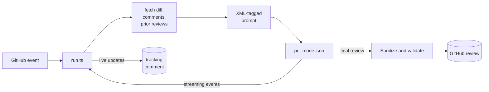

<p align="center">
  
</p>

<p align="center">
  <strong>Review-only AI for pull requests.</strong><br />
  Run one focused Pi review session with native read-only repository tools.
</p>

<p align="center">
  <a href="https://github.com/selimozten/elek/actions/workflows/ci.yml"></a>
  <a href="LICENSE"></a>
</p>

elek is an open AI code-review engine for GitHub pull requests. It posts
normal review comments and inline threads, but it cannot approve, merge, close,
or mutate your base branch in review mode. The model receives native Pi
read/search tools. The host posts the final review.

Use it today as a self-hosted GitHub Action with your own model keys. The
hosted GitHub App is the planned zero-config install path for teams that want
branded reviews, centralized settings, and hosted analytics.

It can run one review session with a focused lens set and any
provider [pi](https://github.com/earendil-works/pi) supports: DeepSeek,
OpenRouter, OpenAI, Anthropic, Google, Bedrock, Vertex, Groq, Mistral,
Together, xAI, and more.

If you want safer AI code review to become boring infrastructure, star the repo
and try it on one real PR.

See it reviewing a real tenant-isolation regression:
[elek-demo#1](https://github.com/selimozten/elek-demo/pull/1).

## One-minute setup

From your repository root:

```bash
npx --package github:selimozten/elek elek-init --provider deepseek
```

Then add one repo secret:

```text
DEEPSEEK_API_KEY
```

Commit the generated `.github/workflows/elek.yml` and `.elek.yml`, open a PR,
and elek will post a live progress comment followed by a structured review with
inline findings on changed lines.

Prefer another provider?

```bash
npx --package github:selimozten/elek elek-init --provider openrouter --model moonshotai/kimi-k2.7-code
npx --package github:selimozten/elek elek-init --provider anthropic --model claude-sonnet-4-6
```

| Path | Status | Use it for |
|---|---|---|
| Hosted GitHub App | Planned primary path | Branded reviews, simple onboarding, hosted analytics, team settings |
| Self-hosted GitHub Action | Available today | BYOK reviews, auditable runs, custom workflow control |
| CLI tools | Available today | Feedback adjudication, saved-run analytics, benchmark evaluation |

## Why elek

| | elek | single-provider review actions | general-purpose CLI actions |
|---|---|---|---|
| **Providers** | 11+ (any pi target) | usually one provider | usually one provider |
| **Per-review cost** | ~$0.005 (deepseek) | often premium-model priced | varies by hosted stack |
| **GitHub review output** | ✓ host-posted | often supported | partial |
| **Iterates on prior findings** | ✓ | often supported | partial |
| **Structural safety** | ✓ no merge/approve/close paths | often broader PR API access | often broader repo access |
| **Modules** | small TypeScript core | larger vendor stack | larger platform stack |
| **Runtime** | Hosted App planned; Action/CLI available | provider CLI/runtime | provider CLI/runtime |

**Use one capable model first.** Extra sessions increase cost and latency. Add a separate workflow only when measured review quality requires model diversity.

## Hosted App status

The public GitHub App install is planned and not yet open. Normal product
onboarding should become "Install the elek GitHub App"; until that path is
available, use the self-hosted Action below.

## Self-hosted Action

The initializer creates `.github/workflows/elek.yml` and `.elek.yml` for the
Action runtime. If you prefer to wire it manually:

1. Add a provider API key to repo secrets (`Settings → Secrets and variables → Actions`):

   ```
   DEEPSEEK_API_KEY  # or OPENROUTER_API_KEY / OPENAI_API_KEY / ANTHROPIC_API_KEY / etc.
   ```

2. Commit the generated files, or drop this in `.github/workflows/elek.yml` manually:

   ```yaml
   name: elek
   on:
     pull_request: { types: [opened, synchronize, reopened] }
     issue_comment: { types: [created] }
     issues: { types: [opened] }

   permissions:
     contents: read           # blocks merge entirely (read-only)
     pull-requests: write     # post review comments
     issues: write            # post tracking comment

   concurrency:
     group: elek-${{ github.event_name }}-${{ github.event.pull_request.number || github.event.issue.number || github.ref }}
     cancel-in-progress: true

   jobs:
     review:
       if: ${{ github.event_name != 'issue_comment' || !endsWith(github.actor, '[bot]') }}
       runs-on: ubuntu-latest
       timeout-minutes: 15
       steps:
         - uses: actions/checkout@v6.0.3
           with: { fetch-depth: 0 }
         - uses: selimozten/elek@v1
           with:
             deepseek_api_key: ${{ secrets.DEEPSEEK_API_KEY }}
             provider: deepseek
             model: deepseek-v4-pro
             thinking: high
   ```

3. Open a PR. Within ~3 minutes you'll see a tracking comment with a live progress checklist, then the final review (top-level summary + inline threads on changed lines).

Useful initializer variants:

```bash
npx --package github:selimozten/elek elek-init --provider openrouter --model moonshotai/kimi-k2.7-code
npx --package github:selimozten/elek elek-init --strategy crosscheck --max-cost-usd 0.05
npx --package github:selimozten/elek elek-init --no-config
```

The final comment includes an estimated token/cost line by default:

```text
Estimated review cost: $0.0012 (3,420 in / 810 out tokens)
```

For models without built-in price hints, elek still reports token estimates and
returns `$0.0000` until you provide `cost_rates`.

To trigger from a comment, set `trigger_phrase` (default `@pi`) and write `@pi review the auth flow`.

## Modes

The `mode` input controls the model's tool surface:

| `mode` | Tools | MCP | Edits | Use case |
|---|---|---|---|---|
| `review` (default) | `read,grep,find,ls` | ✗ | ✗ | Native Pi read-only code review. Recommended. |
| `review+edit` | `read,grep,find,ls` | ✗ | ✗ | Review-only until sandboxed mutation tools are available. |
| `agent` | `+ bash` | ✗ | ✓ | Legacy, full power. Trusted workflows only. |

Use `mode` to choose the tool surface. The low-level `tools` input is kept
for compatibility and debugging; review modes still resolve to the safe mode
presets.

**The review model cannot approve, merge, or close.** Review mode exposes only
read/search tools. The workflow permissions are the backstop.

## Review Strategies

The `review_strategy` input controls orchestration quality:

| `review_strategy` | Runs | Use case |
|---|---:|---|
| `solo` (resolved when unset) | 1 | General review. |
| `crosscheck` | 1 | Risk and design lenses. |
| `council` | 1 | Risk, design, test, and operations lenses. |
| `thermos` | 1 | Selected Thermos lenses, followed by a Ponytail filter. |

Non-solo strategies run only with `mode: review`. Each strategy still starts
one Pi process and uses one model session.

`crosscheck` applies two perspectives in that session:

- **Thermos Security & Correctness Review** — correctness, security, breaking changes, devex regressions, feature-gate leaks.
- **Thermos Code Quality Review** — maintainability, structural simplification, abstraction quality, file-size growth, spaghetti branching, type boundaries.

`council` adds:

- **Test Integrity Review** — missing/weak tests, nondeterminism, meaningless assertions.
- **Operational Review** — rollout/rollback safety, migrations, configuration, observability, retries, partial updates.

`thermos` uses the risk and design lenses by default. You can select from these
additional lenses:

- **Security & Correctness Audit** — concrete bugs, security, auth, data loss, races, and user-visible regressions.
- **Breaking Side-Effects Audit** — cross-module side effects, changed contracts, hidden coupling, and compatibility breaks.
- **DevEx & Config Audit** — local workflow breakage, env/config drift, scripts, generated artifacts, and build/test surprises.
- **Feature Gate & Exposure Audit** — feature leaks, missing guards, internal-only behavior becoming public, and rollout gaps.
- **Tests & Operations Audit** — missing high-signal tests, migrations, observability, timeouts, retries, idempotency, and support burden.

Set `review_lenses` to an ordered comma-separated list when a repository needs
a smaller domain-specific council. In addition to the strategy defaults, elek
provides **Contract Drift Audit** (`contract-drift`) and **Mobile Runtime
Audit** (`mobile-runtime`). Unknown lens IDs fail the review instead of silently
falling back.

The same session applies a Ponytail filter after the selected lenses. It rejects
speculative, duplicate, cosmetic, stale, and pre-existing issues. Elek asks for
one concise final review.

Every finding is expected to follow elek's review contract: severity,
confidence, evidence, impact, and a concrete fix. Low-confidence findings
should be dropped instead of posted.

```yaml
with:
  provider: together
  model: deepseek-ai/DeepSeek-V4-Pro-0813
  thinking: max
  review_strategy: thermos
  review_lenses: risk,design
```

Elek does not set a turn cap or a model-run timeout by default. Pi and the
provider control the session. GitHub Actions can still apply a job timeout.
Changed-line counts never downgrade or skip review coverage. elek uses the
selected model's available context window and includes the full diff whenever
it fits, falling back to a complete file overview plus per-file slices only
when the model context would otherwise overflow.

## Cross-Model Review

Run two providers in parallel for free cross-validation. Each model independently iterates on the other's findings:

```yaml
jobs:
  deepseek:
    runs-on: ubuntu-latest
    steps:
      - uses: actions/checkout@v6.0.3
      - uses: selimozten/elek@v1
        with:
          deepseek_api_key: ${{ secrets.DEEPSEEK_API_KEY }}
          provider: deepseek
          model: deepseek-v4-pro

  kimi:
    name: openrouter-kimi-k2.7-code
    runs-on: ubuntu-latest
    steps:
      - uses: actions/checkout@v6.0.3
      - uses: selimozten/elek@v1
        with:
          openrouter_api_key: ${{ secrets.OPENROUTER_API_KEY }}
          provider: openrouter
          model: moonshotai/kimi-k2.7-code
```

On the second push, each model reads the other's prior findings (kept in the comment thread) and opens its review with a status table — fixed / still present / no longer relevant — before listing new findings.

## How it works



A composite Action installs Node and Pi, then `tsx` runs the host. Pi streams
JSONL events. Elek updates progress, validates the final text, and posts it.

Full architecture: [docs/ARCHITECTURE.md](docs/ARCHITECTURE.md).

## Public roadmap

- **GitHub App primary install** — make the hosted elek App the default way to
  add review-only AI to a repository, with the Action remaining the advanced
  self-hosted runtime.
- **Opt-in telemetry contract** — publish redacted telemetry schemas and client
  redaction tests so teams can choose aggregate or finding-metadata reporting
  without sending raw code, raw diffs, prompts, file paths, branch names,
  commit SHAs, secrets, or author identities.
- **Model-quality analytics** — build on `elek-feedback`, `elek-analytics`,
  and `elek-eval` so teams can compare models by accepted findings, false
  positives, cost, latency, and inline-comment health.

## Inputs

### Trigger / behavior

| Input | Default | Notes |
|---|---|---|
| `trigger_phrase` | `@pi` | Detected in comments, issue body, PR body |
| `prompt` | _(comment text)_ | Explicit prompt; bypasses trigger detection |
| `mode` | `review` | `review` / `review+edit` / `agent`; `review+edit` is currently read-only |
| `config_path` | `.elek.yml` | Repo-local defaults and review policy; use `none`, `off`, or `false` to disable |
| `review_strategy` | _(resolved)_ | `solo` / `crosscheck` / `council` / `thermos` |
| `review_lenses` | _(strategy defaults)_ | Ordered built-in lens IDs, e.g. `security-correctness,contract-drift,mobile-runtime` |
| `severity_threshold` | _(.elek.yml or unset)_ | Prompt-level reviewer threshold: `critical`, `important`, or `minor` |
| `show_cost` | `true` | Show estimated token usage and review cost in comments/logs; outputs are always set |
| `cost_rates` | _(empty)_ | Optional price overrides as `model=inputPerMillion:outputPerMillion` |
| `actor_filter` | _(empty)_ | Comma-separated allowlist of usernames; empty allows repository owners, members, and collaborators |
| `allowed_bots` | _(empty)_ | Comma-separated bot logins, or `*` for all |
| `sticky_comment` | `true` | Reuse the same tracking comment across pushes |

### Model

| Input | Default | Examples |
|---|---|---|
| `provider` | `anthropic` | `deepseek`, `openrouter`, `openai`, `anthropic`, `google`, `groq`, `mistral`, `together`, `xai` |
| `model` | _(provider default)_ | `deepseek-v4-pro`, `moonshotai/Kimi-K2.7-Code`, `Qwen/Qwen3.7-Max`, `claude-sonnet-4-6`, `claude-opus-4-8`, `gpt-5.5`, `gemini-3.1-pro-preview` |
| `thinking` | `medium` | Portable pi levels: `off` / `minimal` / `low` / `medium` / `high` / `xhigh` / `max` |
| `system_prompt` | _(pi default)_ | Override pi's system prompt |
| `max_turns` | _(none)_ | Optional conversation turn cap |
| `run_timeout_seconds` | _(none)_ | Optional wall-clock cap for one Pi run |
| `tools` | _(mode-resolved)_ | Legacy low-level allowlist; review modes use `mode` presets |
| `base_branch` | _(repo default)_ | Override the comparison base |
| `branch_prefix` | `elek/` | Prefix for branches the action creates |

## Outputs

| Output | Notes |
|---|---|
| `conclusion` | `success`, `failure`, or `skipped` |
| `summary` | First 1,000 chars of the final review text |
| `cost_usd` | Aggregate estimated USD cost across all model runs |
| `input_tokens` / `output_tokens` | Aggregate estimated token usage |
| `review_summary_path` | Path to `elek-review-summary.json` on the runner |
| `review_summary_json` | Same summary as a single-line JSON output |

The review summary JSON includes run duration, requested/executed strategy,
model labels, parsed findings, per-model token/cost estimates, pricing source,
and inline comment counts. Use `review_summary_path` with your own artifact
upload step when you want to compare models or review strategies across CI
runs. If the runner cannot write the optional file, `review_summary_path` is
set to an empty string while `review_summary_json` is still emitted.

Adjudicate each finding after the implementation agent has handled the PR:

```bash
npx --package github:selimozten/elek elek-feedback --template artifacts/pr-42/elek-review-summary.json > feedback.json
# Fill verdict/points per finding: accepted, partial, rejected, or unreviewed.
npx --package github:selimozten/elek elek-feedback --apply feedback.json artifacts/pr-42/elek-review-summary.json > artifacts/pr-42/adjudicated-summary.json
```

Feedback is stored on each finding with a `0-5` integer score, evaluator,
timestamp, and note. This lets humans or implementation agents mark whether a
model's finding was accepted, partially useful, or rejected before analytics
aggregates model quality. Applying feedback is a replacement step: findings
omitted from the feedback file are reset to `unreviewed`.

Aggregate saved summaries to compare strategies, models, repositories, cost,
latency, findings, and inline comment outcomes:

```bash
npx --package github:selimozten/elek elek-analytics --group-by model artifacts/*/adjudicated-summary.json
```

Compare two saved artifact sets to spot regressions in success rate, finding
volume, inline comment health, latency, and cost:

```bash
npx --package github:selimozten/elek elek-analytics --group-by model \
  --baseline artifacts/before/*/adjudicated-summary.json \
  --current artifacts/after/*/adjudicated-summary.json
```

Add `--json` to feed dashboards, release reports, scheduled quality checks, or
community model-quality leaderboards.

## Model evaluation

Use `elek-eval` to score saved `elek-review-summary.json` files against your
own seeded PR benchmark suite:

```bash
npx --package github:selimozten/elek elek-eval --suite review-benchmark.yml artifacts/*/elek-review-summary.json
```

Bootstrap an editable suite case from a known-good summary:

```bash
npx --package github:selimozten/elek elek-benchmark --id auth-regression artifacts/auth/elek-review-summary.json > review-benchmark.yml
```

Example suite:

```yaml
version: 1
cases:
  - id: auth-regression
    repository: owner/repo
    number: 42
    expected_findings:
      - id: tenant-bypass
        min_severity: critical
        keywords: [tenant, session, bypass]
    max_false_positives: 0
```

`elek-eval` reports recall, precision, false positives, duration, and cost per
summary, then exits non-zero if a run misses expected findings or exceeds the
false-positive budget. Add `--json` for machine-readable output. Generated
benchmark cases are meant to be reviewed and edited before they become policy.

## Repo Config

Add `.elek.yml` to keep review defaults and repo-specific policy next to the
code. Workflow inputs still win when they are set explicitly.

```yaml
review_strategy: crosscheck
review_lenses: risk,contract-drift
cost_rates: openrouter/moonshotai/kimi-k2.7-code=0.95:4.00,deepseek/deepseek-v4-pro=0.25:1.00
severity_threshold: important

knowledge_paths:
  - AGENTS.md
  - CONTRIBUTING.md
  - docs/ARCHITECTURE.md

ignore_paths:
  - docs/**
  - "*.md"

instructions:
  - Treat auth and permission changes as security-sensitive.
  - Require tests for parser and config changes.
```

Supported keys: `review_strategy`, `review_lenses`, `cost_rates`, `severity_threshold`,
`knowledge_paths`, `ignore_paths`, and `instructions`.
Old model-lane and cost-cap keys remain accepted for workflow compatibility,
but one-session reviews ignore them.
`cost_rates` uses the same `model=inputPerMillion:outputPerMillion` format as
the workflow input.
`severity_threshold` accepts `critical`, `important`, or `minor`. Severity
and ignore-path policy are prompt instructions for the reviewer, not a
server-side filter. If an existing config file has malformed YAML, elek fails
the run instead of silently dropping repo policy.

On pull requests, policy and guidance fields (`review_strategy`,
`review_lenses`, `cost_rates`, `severity_threshold`, `knowledge_paths`,
`ignore_paths`, and `instructions`)
are loaded from the base branch when available. The checked-out pull request
cannot weaken its own review policy or inject review instructions. `knowledge_paths` points elek at repo-local docs that should
shape review judgment, such as agent instructions, contribution guidelines,
architecture notes, or ADR folders. When unset, elek automatically tries
`AGENTS.md`, `CONTRIBUTING.md`, `docs/ARCHITECTURE.md`, and `docs/adr`. Loaded
files are bounded by count and byte size before they enter the prompt. Each run
logs the loaded config source plus effective strategy/model/severity choices.
If elek cannot
resolve a PR comment trigger's actual base branch, it skips base-branch policy
loading for that run instead of guessing from the default branch; policy fields
from the checked-out workspace are not used as a fallback. For `issue_comment`
triggers, "checked-out branch" is whatever the workflow checked out, usually
the default branch unless the workflow explicitly checks out the PR head.

### API keys

Each provider has its own input; only set the one you use. Pi reads the matching `*_API_KEY` env var.

| Input | Env var |
|---|---|
| `anthropic_api_key` | `ANTHROPIC_API_KEY` |
| `openai_api_key` | `OPENAI_API_KEY` |
| `google_api_key` | `GOOGLE_API_KEY` |
| `deepseek_api_key` | `DEEPSEEK_API_KEY` |
| `groq_api_key` | `GROQ_API_KEY` |
| `mistral_api_key` | `MISTRAL_API_KEY` |
| `together_api_key` | `TOGETHER_API_KEY` |
| `xai_api_key` | `XAI_API_KEY` |
| `openrouter_api_key` | `OPENROUTER_API_KEY` |

For AWS Bedrock: `AWS_REGION`, `AWS_ACCESS_KEY_ID`, `AWS_SECRET_ACCESS_KEY` as job-level env. For Vertex: `GOOGLE_APPLICATION_CREDENTIALS`, `ANTHROPIC_VERTEX_PROJECT_ID`.

## Outputs

| Output | Description |
|---|---|
| `conclusion` | `success` / `failure` / `skipped` |
| `branch_name` | The `elek/*` branch created (if any) |
| `comment_id` | The tracking comment ID |
| `session_id` | Pi session ID for resumption |
| `summary` | First 1000 chars of the review |
| `cost_usd` | Estimated review cost in USD |
| `input_tokens` | Estimated input tokens across all review runs |
| `output_tokens` | Estimated output tokens across all review runs |

## Permissions

```yaml
permissions:
  contents: read           # blocks merge — model literally can't push to base
  pull-requests: write     # post review comments
  issues: write            # post tracking comment
```

Keep `contents: read` for `review` and `review+edit`. Both use repo-scoped
file tools. Use `agent` only in trusted workflows that allow edits and pushes.
Review-mode Pi does not receive the GitHub token.

## Supported events

- `pull_request` — opened, synchronize, reopened
- `issues` — opened
- `issue_comment` — created (on PRs or issues)
- `pull_request_review` — submitted
- `pull_request_review_comment` — created

## Cost visibility

elek shows review cost in the final comment and exposes the same data as action
outputs. When pi emits provider usage, elek uses those exact input/output token
counts and provider cost, including the model's analysis/reasoning step. When
provider usage is missing or zero, elek falls back to prompt/output token
estimates and configured price hints.

Set `show_cost: false` to hide the visible comment/log line. The `cost_usd`,
`input_tokens`, and `output_tokens` action outputs are still populated for
downstream workflow steps.

Built-in price hints cover the recommended low-cost defaults:

| Model | Price source | Notes |
|---|---|---|
| `deepseek/deepseek-v4-pro` | built in | Strong low-cost reviewer |
| `openrouter/moonshotai/kimi-k2.7-code` | built in | Independent reviewer through OpenRouter |
| `together/moonshotai/Kimi-K2.7-Code` | built in | Fast low-cost reviewer through Together |
| `together/deepseek-ai/DeepSeek-V4-Pro-0813` | bundled registration | DeepSeek reviewer through Together |
| `together/Qwen/Qwen3.7-Max` | built in | Independent Qwen reviewer through Together |
| `openai/gpt-5.5` | built in | Frontier reviewer |

For premium or newer models, pass your provider's current prices in USD per 1M
tokens:

```yaml
with:
  show_cost: true
  cost_rates: openai/gpt-5.5=5:30,custom/provider-model=1.25:10
```

Diff context is model-aware. elek budgets approximately 540K prompt characters
for GLM-5.2, 700K for GPT-5.6, and 2.7M for Kimi K3 after reserving output and
provider framing. The full diff is included whenever it fits. Context-window
overflow keeps the complete file overview and uses large per-file slices; it
never reduces the requested reviewer strategy or lens count.

Review strategies select perspectives. They do not multiply Pi sessions.

## Security

- Review mode gives Pi native `read`, `grep`, `find`, and `ls` tools. A small
  preflight hook blocks paths outside the workspace, `.git`, secret files, and
  symlink escapes.
- The host can post review comments. It has no approve, merge, or close path.
- Token sanitization redacts `ghp_`, `ghs_`, `gho_`, `ghu_`, `ghr_`, and `github_pat_` prefixes from any model output before it reaches GitHub.
- Review-mode Pi does not receive `GITHUB_TOKEN`.

Threat model: a fully jailbroken model still cannot perform destructive operations because the plumbing doesn't exist. The `permissions:` scope is the backstop.

## Documentation

- [`docs/ARCHITECTURE.md`](docs/ARCHITECTURE.md) — system overview
- [`docs/setup.md`](docs/setup.md) — step-by-step setup
- [`docs/examples.md`](docs/examples.md) — workflow recipes
- [`docs/PRODUCT_RESEARCH.md`](docs/PRODUCT_RESEARCH.md) — market gaps and product roadmap
- [`docs/BRAND.md`](docs/BRAND.md) — brand assets, palette, voice, and usage rules
- [`docs/TELEMETRY.md`](docs/TELEMETRY.md) — opt-in telemetry consent levels and redaction contract
- [`AGENTS.md`](AGENTS.md) — instructions for coding agents working on elek
- [`CONTRIBUTING.md`](CONTRIBUTING.md) — how to contribute

## Credits

Built on [pi coding agent](https://github.com/earendil-works/pi).

## License

MIT
