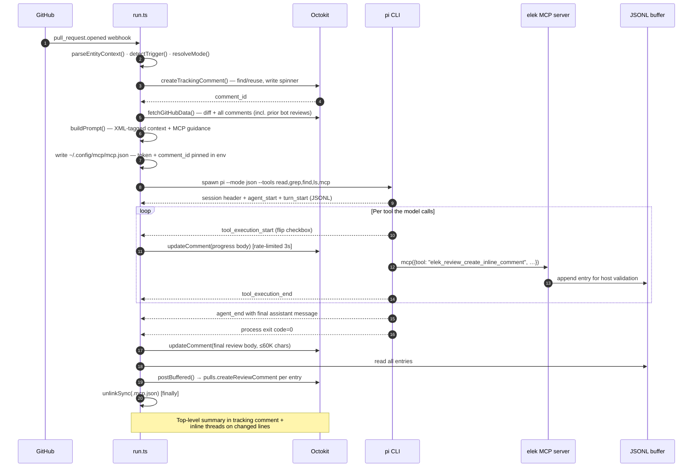

# Architecture

This document describes the public self-hosted GitHub Action runtime and open
review engine. The planned hosted GitHub App should use the same review-only
core and safety boundaries, but hosted queueing, billing, dashboards, and
model-routing operations are outside this public repo.

## One-paragraph summary

The self-hosted runtime is a composite GitHub Action: action.yml installs Node + the pi CLI,
then `tsx` invokes a single TypeScript orchestrator (`src/entrypoints/run.ts`)
that parses the webhook event, fetches PR/issue data via the GitHub API,
builds XML-tagged prompts, and spawns `pi --mode json` in child processes.
Pi runs the chosen model(s) with a tightly-scoped tool surface, streams events
back as JSONL, and elek converts the final run into progressive comment updates.
When the model uses MCP tools (`create_inline_comment`, `update_tracking_comment`)
their effects are buffered to disk during the run; a post-step drains the
buffer to GitHub's PR review-comments API.

## Components

### `action.yml` — composite action declaration

Inputs: provider, model, mode, thinking level, per-provider API keys,
trigger phrase, actor filter, etc. Exposes the same surface for any pi-supported
provider — the per-provider `*_api_key` inputs are just env-var pass-throughs
(pi reads `ANTHROPIC_API_KEY`, `DEEPSEEK_API_KEY`, etc. from process.env).

Setup steps: `npm install --omit=dev --no-package-lock` in `$GITHUB_ACTION_PATH`, prepend
`node_modules/.bin` to `$GITHUB_PATH`, optionally `pi install npm:pi-mcp-adapter`.

Run step: `tsx src/entrypoints/run.ts` with the inputs forwarded as `INPUT_*`
env vars (read by `@actions/core`).

### `src/entrypoints/run.ts` — orchestrator

The single end-to-end runner. Phases:

1. **Parse inputs + event context** (`parseInputs`, `parseEntityContext`).
2. **Trigger detection** — `@pi` mention in body/comment, label match, or
   explicit `prompt` input. Actor filter applied.
3. **Setup** — Octokit client, mode resolution (`resolveMode`), git auth,
   elek/* branch creation for PRs.
4. **Tracking comment** — find existing by signature, reuse or create new.
5. **Data fetch + prompt** — PR diff, issue body, all comments (including
   bot's own prior reviews so the model can iterate), build the structured
   prompt.
6. **Optional review strategy** — `solo` runs the final reviewer directly.
   `crosscheck` runs two read-only candidate lenses first (risk + design).
   `council` runs four read-only candidate lenses first (risk + design +
   tests + operations). Candidate runs have no MCP access and cannot post.
7. **MCP wiring** — immediately before the final posting-capable run, write
   `~/.config/mcp/mcp.json` pointing pi-mcp-adapter at our review server, with
   `GITHUB_TOKEN` and `ELEK_TRACKING_COMMENT_ID` in the server env. The file
   is `unlinkSync`'d in a `finally` after pi exits.
8. **Run final pi** — `runPi(prompt, inputs, onProgress, mcpEnabled)`. The
   onProgress callback updates the tracking comment with a checklist body
   (rate-limited to 3s, last update flushed on the `done` event).
9. **Post review** — replace the tracking-comment body with the model's
   final review text (truncated at 60K chars).
10. **Drain MCP buffer** — `postBuffered()` reads the JSONL file the MCP
   server appended to during the run, posts each non-opted-out entry as a
   PR review comment after validating anchors against PR diff hunks when the
   GitHub file patches are available.
11. **Optional code push** — if `mode: review+edit` or `agent` and the model
    made local changes, commit and push to the elek/* branch.

### `src/review/strategy.ts` — cross-model review planning

Defines the strategy names and prompt builders:

```
solo       → existing one-model review
crosscheck → Risk + Design + optional independent advisor, then final validation/synthesis
council    → Risk + Design + Test Integrity + Operations + optional advisor, then final validation/synthesis
thermos    → configurable built-in lens council + optional advisor, then final validation/synthesis
```

Candidate reviewers run as independent `pi` processes with only
`read,grep,find,ls`, no MCP proxy, and a filtered environment. Their output is
internal evidence. `review_lenses` can select a bounded domain-specific council,
and `advisor_model` can add provider diversity without another sequential
phase. Set `advisor_model: off` to omit that lane while preserving the required
review lenses and final validator. The final orchestrator receives the candidate reports, rejects
speculative or duplicate findings, and is the only run allowed to call elek's
review MCP tools.

### `src/pi.ts` — pi CLI runner

Spawns pi with `stdio:["ignore","pipe","pipe"]` (stdin closed — pi hangs
otherwise), `--mode json` for streaming, restricted tools per the resolved
mode. Parses pi's JSONL output:

| Event | Used for |
|---|---|
| `session` | Capture sessionId for output |
| `tool_execution_start/end` | Drive progress checkbox state |
| `message_update` w/ `text_delta` | Streaming text indicator |
| `message_update` w/ `thinking_delta` | "Analyzing…" indicator |
| `agent_end` | Authoritative final assistant message text |

Returns a `PiRunResult` with conclusion, output, sessionId, turn count.

### `src/github/mode.ts` — tool/permission presets

```
review (default)  → tools: read,grep,find,ls,mcp           | MCP on  | edit off
review+edit       → tools: read,grep,find,ls,mcp           | MCP on  | edit off
agent (legacy)    → tools: read,write,edit,bash,grep,find,ls | MCP off | edit on
```

The `mcp` allowlist entry is critical — without it, pi-mcp-adapter's proxy
tool is filtered and the model can't reach the MCP server.

### `src/mcp/handlers.ts` — review-only tool surface (PURE)

Exports:

- `createInlineComment(deps, args)` — appends every model-authored finding to
  the action buffer. Model-authored comments cannot bypass host validation.
- `updateTrackingComment(deps, args)` — updates the env-pinned `comment_id`
  via `issues.updateComment`. Arg-level `comment_id` is structurally
  inaccessible (TypeScript signature only takes `{body}`).
- `buildReviewCommentParams` — shared builder for the API params.
- `sanitize` — redacts ghp/ghs/gho/ghu/ghr_ classic tokens and
  `github_pat_*` fine-grained PATs from any body before persisting.

No code path here for `pulls.createReview`, `pulls.merge`, or
`issues.update({state:closed})`. Adding one is a change to the safety story.

### `src/mcp/github-review-server.ts` — MCP shim

Thin wrapper around handlers: wires them into `McpServer` from
`@modelcontextprotocol/sdk`, registers `create_inline_comment` and
`update_tracking_comment` with zod schemas, starts a stdio transport.
pi-mcp-adapter spawns this as a child process and prefixes the tool
names with `elek_review_*`.

### `src/entrypoints/post-buffered.ts` — post-step drain

`postBuffered(deps)` reads the JSONL buffer line-by-line, skips entries
with `confirmed:false` (explicit opt-out), validates file/line
anchors against `pulls.listFiles` patch hunks, and posts survivors as a grouped
review when available, with `pulls.createReviewComment` fallback. Caches PR head SHA fetch failures so a bad token
doesn't amplify into N rate-limit hits. Returns `{posted, skipped, failed}`.

## Data flow for the typical PR review



## What the MCP layer adds vs. plain stdout review

Without MCP (mode=agent): pi runs, prints final assistant text, elek puts
that text in a single tracking comment. Like a long Slack message.

With MCP (mode=review/review+edit): pi gets the `mcp` proxy tool. The model
can post per-line review threads on specific files, AND maintain a live
checklist in the tracking comment as it works. End result on GitHub looks
like a human reviewer's submission — top-level summary + threads on the
diff itself.

The MCP path is the difference between a wall-of-text review and a real,
navigable PR review.

## Why pi (not the SDK)

pi has an SDK, but using it would lock us to whatever runtime pi targets
and require us to bundle it. The CLI is provider-agnostic by design — pi
discovers credentials from env vars per provider, applies the right model
adapter, and streams events. We just spawn it and parse JSONL. That keeps
elek to ~1500 lines of TS instead of pulling in pi's whole tree.

## Why not pi's bash tool

`bash` would let the model `gh pr merge` or `curl https://api.github.com/...`
directly. That defeats the structural safety guarantee. The `mcp` proxy
plus read-only file tools (`read,grep,find,ls`) is enough for code review;
broader access lives behind `mode: agent` for users who explicitly opt in.
