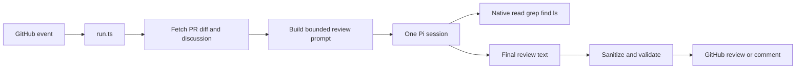

# Architecture

Elek is a small host wrapper around the Pi CLI. Review mode starts one Pi
session, gives it native read-only tools, and posts its final answer to GitHub.

## Review flow



The host does this work:

1. Parse the action inputs and GitHub event.
2. Load review policy and knowledge from the pull request base branch.
3. Fetch the diff, pull request data, and prior review discussion.
4. Build one prompt with the selected review lenses.
5. Start one `pi --mode json` process.
6. Stream progress from Pi JSON events.
7. Sanitize and validate the final model response.
8. Post the result through Octokit.

Review mode does not add a turn cap or a model-run timeout. Optional action
inputs can add these limits when a repository needs them.

## Review strategies

Strategies select perspectives. They do not select agent counts.

```text
solo       -> general review
crosscheck -> risk + design
council    -> risk + design + tests + operations
thermos    -> selected Thermos lenses + Ponytail filter
```

`src/review/strategy.ts` adds the selected perspectives to one user request.
The same model session verifies candidates and returns one final review.

## Pi process

`src/pi.ts` starts Pi with these review-mode controls:

- `--mode json`
- `--no-session`
- `--no-skills`
- `--no-context-files`
- `--no-extensions`
- `-e src/pi-workspace-guard.ts`
- `--tools read,grep,find,ls`

Pi uses its native tools and normal agent loop. A small tool-call hook blocks
paths outside the workspace, `.git`, secret files, and symlink escapes. It does
not replace native tool behavior. Elek closes standard input and reads JSONL.

The runner records the final assistant message, stop reason, token use, cost,
turn count, and provider retry count. It retries once only for a confirmed
transport failure.

## Prompt data

`src/github/data.ts` builds the review prompt. It includes:

- the pull request title and description;
- the base and head references;
- the unified diff;
- prior discussion when available;
- base-branch policy and bounded project knowledge;
- the selected review lenses;
- a concise GitHub review response shape.

The diff is the first source of evidence. The model uses repository tools only
when it must resolve a specific uncertainty.

Pull request changes cannot alter their own review instructions. Elek loads the
policy and knowledge files from `origin/<base branch>` when that source exists.

## Public output

`src/review/public-output.ts` does not require one exact parser contract. It:

- removes internal research text and delivery chatter;
- removes model-generated cost footers;
- sanitizes token-shaped secrets;
- rejects empty output and unsafe merge approval claims;
- keeps useful findings in normal GitHub review styles.

The action succeeds only when Pi succeeds, the review is usable, and GitHub
receives the review.

## Security boundary

Review-mode Pi receives no `GITHUB_TOKEN`. It has no shell, write, edit, or MCP
tool. The workspace guard also blocks token files and parent process paths.
The host owns GitHub delivery and uses the workflow permission scope.

The normal workflow grants:

```yaml
permissions:
  contents: read
  pull-requests: write
  issues: write
```

The model cannot approve, merge, close, or push through the review tool surface.

## Main modules

| Module | Responsibility |
|---|---|
| `src/entrypoints/run.ts` | End-to-end action control and GitHub delivery |
| `src/config.ts` | Config parsing and trusted base-branch context |
| `src/github/data.ts` | Diff collection and prompt construction |
| `src/review/strategy.ts` | One-session review lens selection |
| `src/pi.ts` | Pi process, JSON events, metrics, and typed failures |
| `src/review/run-recovery.ts` | One transport-only retry |
| `src/review/public-output.ts` | Public review sanitation and validation |

Legacy agent mode remains for trusted automation. It does not change the
default review path.
